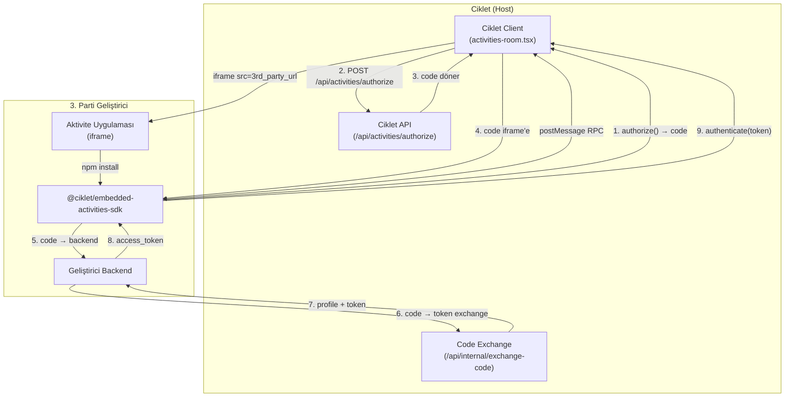

# Ciklet Embedded Activities SDK — Walkthrough

Ciklet'un `@ciklet/embedded-app-sdk` mimarisinin birebir klonunu Ciklet'e kazandırdık. Artık **hiçbir aktivite kodu Ciklet repo'sunda bulunmuyor**. Tüm aktiviteler 3. parti uygulamalar olarak ayrı sunucularda barındırılıyor.

## Mimari



## Silinen Dosyalar

| Klasör/Dosya | Açıklama |
|--------------|----------|
| `activities/` (tüm klasör) | WatchTogether SPA, GlobeCanvas SPA, Dockerfile, nginx.conf |
| `packages/activities-api/` (tüm klasör) | Express + Socket.IO mikroservis |
| Eski `packages/embedded-activities-sdk/` | İlk versiyon SDK |

## Oluşturulan Dosyalar

### @ciklet/embedded-activities-sdk (YENİDEN YAZILDI)

| Dosya | Açıklama |
|-------|----------|
| [package.json](file:///c:/Users/Livvaa/Desktop/Erik/packages/embedded-activities-sdk/package.json) | Dual ESM/CJS export, npm publish ready |
| [types.ts](file:///c:/Users/Livvaa/Desktop/Erik/packages/embedded-activities-sdk/src/types.ts) | Ciklet-style enums, interfaces, event map |
| [CikletSDK.ts](file:///c:/Users/Livvaa/Desktop/Erik/packages/embedded-activities-sdk/src/CikletSDK.ts) | Ana sınıf — `DiscordSDK` karşılığı |
| [rpc.ts](file:///c:/Users/Livvaa/Desktop/Erik/packages/embedded-activities-sdk/src/utils/rpc.ts) | postMessage transport layer |
| [index.ts](file:///c:/Users/Livvaa/Desktop/Erik/packages/embedded-activities-sdk/src/index.ts) | Barrel re-exports |
| [README.md](file:///c:/Users/Livvaa/Desktop/Erik/packages/embedded-activities-sdk/README.md) | 3. parti geliştirici rehberi |

### Ciklet Host-Side

| Dosya | Açıklama |
|-------|----------|
| [activities-host-protocol.ts](file:///c:/Users/Livvaa/Desktop/Erik/src/components/activities-host-protocol.ts) | RPC constants (host tarafı) |
| [activities-room.tsx](file:///c:/Users/Livvaa/Desktop/Erik/src/components/activities-room.tsx) | iframe container + RPC handler |

## Değiştirilen Dosyalar

| Dosya | Değişiklik |
|-------|------------|
| [globe-client.tsx](file:///c:/Users/Livvaa/Desktop/Erik/src/app/(main)/(routes)/globe/globe-client.tsx) | `NEXT_PUBLIC_GLOBE_CANVAS_URL` env variable kullanıyor |
| [route.ts](file:///c:/Users/Livvaa/Desktop/Erik/src/app/api/activities/route.ts) | Env-based activity kayıt |
| [docker-compose.yml](file:///c:/Users/Livvaa/Desktop/Erik/docker-compose.yml) | activities + activities-api servisleri kaldırıldı |
| [nginx.conf](file:///c:/Users/Livvaa/Desktop/Erik/docker/nginx.conf) | Activity proxy kuralları kaldırıldı |
| [next.config.js](file:///c:/Users/Livvaa/Desktop/Erik/next.config.js) | Rewrite'lar kaldırıldı, CSP güncellendi |

## SDK Kullanımı (3. Parti Geliştirici İçin)

```typescript
// 3. parti aktivite uygulamasında:
import { CikletSDK } from '@ciklet/embedded-activities-sdk';

const sdk = new CikletSDK('CLIENT_ID');
await sdk.ready();
const { code } = await sdk.commands.authorize({ client_id: 'CLIENT_ID', scope: ['identify'] });
// ... backend'de code → token exchange ...
await sdk.commands.authenticate({ access_token: '...' });
```

## Yeni Environment Variables

| Variable | Açıklama |
|----------|----------|
| `WATCH_TOGETHER_URL` | Watch Together uygulamasının URL'si (3. parti sunucu) |
| `NEXT_PUBLIC_GLOBE_CANVAS_URL` | Globe Canvas uygulamasının URL'si (3. parti sunucu) |
| `ACTIVITY_URLS` | Ek aktiviteler: `id\|name\|url\|icon,...` |
| `ALLOWED_ACTIVITY_ORIGINS` | CSP'de izin verilen aktivite origin'leri |

## Kaldırılan Environment Variables

| Variable | Neden |
|----------|-------|
| `NEXT_PUBLIC_ACTIVITIES_URL` | Artık tek bir activities URL yok — her app kendi domain'inde |
| `ACTIVITIES_INTERNAL_URL` | Internal proxy yok |
| `ACTIVITIES_API_INTERNAL_URL` | activities-api servisi yok |
| `ACTIVITIES_JWT_SECRET` | JWT yönetimi 3. parti dev'e ait |
| `VITE_CIKLET_URL` | Vite build yok |
| `VITE_ACTIVITIES_API_URL` | activities-api yok |
| `VITE_PARENT_ORIGIN` | Parent origin yok |

> [!TIP]
> Artık Docker'ı yeniden build ettiğinizde sadece **app, db, proxy, livekit** çalışacak. Hiçbir aktivite konteyneri olmayacak.
